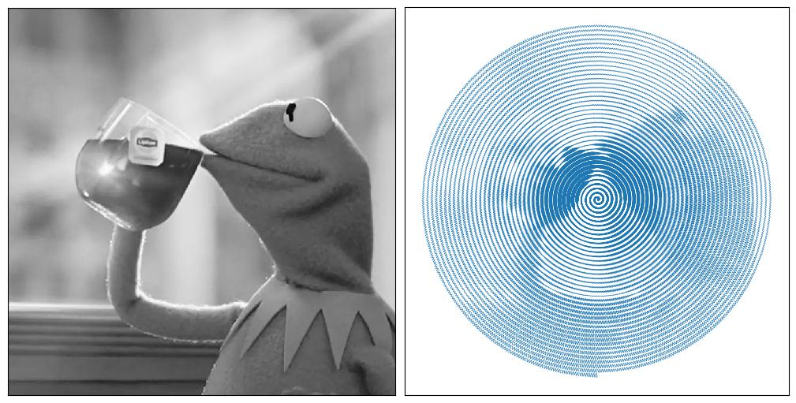

# What is this?

This is a python script/demo which takes a grayscale image and encodes it as a
discrete parametric curve which gives an impression of the image based on 
perceived density of lines.

# To run
To use, clone this repository and modify the script to load your image. 
The code should display the figure (your results may vary based on your IDE).

# Requirements
* numpy (various array operations)
* PIL (to load images)
* matplotlib (to visualize)

# TODO
* Library of curves (other spirals; space-filling curves)
* Address issues of bunching (linear spiral bunches at the origin)

# Acknowledgments
This was inspired by a random user post on imgur (possibly reddit) who was doing 
something similar with a mechanical printing device about 8-10 years ago (as of Jan 2026).
They might have been trying to turn it into an Etsy store or similar; not sure. 
If you know who this is/was, or can find the post, please reach out to me. 
If by chance this is your design and you want this taken down, license modified, etc, don't hesitate to reach out.

